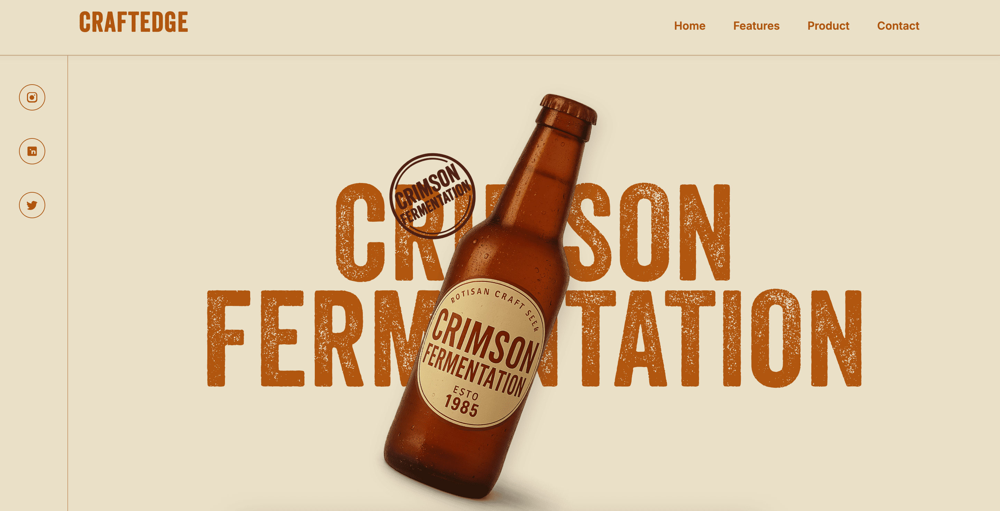

# 🍾 GSAP | Animated Bottle Scroll

A smooth, scroll-triggered vintage bottle animation site built using **GSAP**, crafted with a love for design, animation, and storytelling. Perfect for craft brands, beverage portfolios, or interactive landing pages.

---

## 🌐 Demo

- 🚀 Live Site → [GSAP Animated Bottle Scroll](https://ubiquitous-tarsier-78de93.netlify.app/)
---

## 📸 Preview



---

## 🛠️ Getting Started

Want to run it locally? Let’s go:

1. **Clone the Repo**
   ```bash
   git clone https://github.com/YakshTechs/ferment-flow.git
   cd ferment-flow
```
```
 2.  **Run the Project**
     ```bash
     Start Live Server on teh editor.
   ```

```
* * *

## 📽️ Tutorial

🎥 Watch the full walkthrough on YouTube:  
[](https://www.youtube.com/@PixelPerfectLabs)

* * *

## 🧑‍💻 Tech Stack

* *   💚 [GSAP (GreenSock Animation Platform)](https://gsap.com/)
*     
* *   🧾 HTML5 / CSS3 / JavaScript (Vanilla)
*     
* *   🎨 Custom SVG / Vintage Graphics
*     
* *   📱 Fully Responsive Layout
*     

* * *

## 🤝 Connect With Me

* *   💼 [LinkedIn](https://www.linkedin.com/in/yaksh-devani/)
*     
* *   🐙 [GitHub](https://github.com/yaksh9737)
*     
* *   🐦 [X / Twitter](https://twitter.com/yaksh_devani)
*     

* * *

> Thank you for the love! 🙏

* * *

## 📌 License

This project is open-source and free to use under the [MIT License](https://chatgpt.com/c/LICENSE).

* * *

Made with ❤️ by [Yaksh Devani](https://www.github.com/YakshTechs)

```
